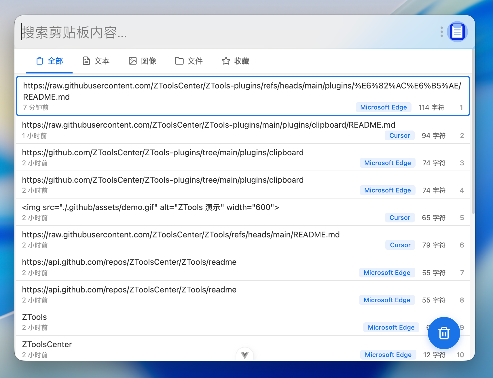

# Sycaclip

基于 ZTools 官方 `clipboard` 二次开发的增强版剪贴板插件，面向高频剪贴板整理、筛选和批量操作场景。

## 截图



## 特色功能

- 自定义分组：支持新建普通分组，将剪贴板记录移入指定分组。
- 关键词分组：创建分组时可设置“内容包含某个关键词”，自动归类匹配记录。
- 分组面板折叠：顶部工具区可折叠，常用状态下界面更简洁。
- 批量选择与批量移动：支持多选记录并批量移入目标分组。
- 来源应用筛选：可按来源应用快速过滤当前列表。
- 图片增强操作：支持直接打开图片文件。
- 文件与文件夹增强操作：支持打开、定位、复制路径等常用动作。
- 更清晰的选中反馈：整条记录高亮，便于识别当前项和多选状态。
- 焦点与唤起修复：修复插件呼出后输入框焦点异常，以及重复快捷键呼出时界面混合/转圈的问题。

## 主要改动

- 保留官方 `clipboard` 的历史记录基础能力。
- 增加分组系统，并支持普通分组与关键词分组。
- 增加选中项上下文操作与批量移动能力。
- 优化顶部工具栏占位与视觉结构。
- 调整多选交互，使批量整理更顺手。
- 增强图片、文件、文件夹记录的操作能力。

## 使用说明

### 基础操作

- 搜索或指令呼出插件后，直接在输入框中筛选记录。
- 点击左侧分组或来源应用筛选，查看对应子集。
- 点击记录可选中，按 `Ctrl` 可继续多选其他记录。
- 选中后可将记录移入指定分组，或执行对应资源操作。

### 分组说明

- 普通分组：手动整理用，适合临时归档或主题归类。
- 关键词分组：输入关键词后，内容命中即自动归入该分组。
- “全部” 会显示完整历史记录。
- “未分组” 仅显示尚未被手动归类的记录。

### 资源操作

- 文本：复制、搜索、归组。
- 图片：复制、打开图片、归组。
- 文件/文件夹：复制路径、打开、打开所在位置、归组。

## 开发

```bash
npm install
npm run dev
npm run build
```

开发目录中的正式构建产物位于 `dist`，可进一步整理为正式插件目录或打包为 `.zpx` 安装包。

## 说明

- 本插件是面向个人使用习惯定制的增强版实现。
- 若修改 `public/plugin.json`、图标或构建资源，请重新执行构建后再打包。

## 作者

Sycamore
